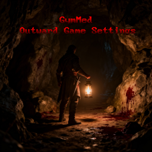

<h1 align="center">
    Outward Game Settings
</h1>
 

  

	
	

This Outward mod allows you to change the way game works.

## Available Settings

    
Require Enchantment Recipe To Enchant

_Attempting to enchant an item without the required enchantment recipe in your inventory (pocket or backpack) will display an error and cancel the process. Config setting: `RequireRecipeToAllowEnchant`._ 

    
Consume Enchantment on Use

_Successfully enchanting an item consumes the enchantment recipe from your inventory. Recommended to use together with `Enchanting Requires Enchantment` setting. Config setting: `UseRecipeOnEnchanting`_ 

    
Enchanting Success Chance

_Enchanting an item can fail based on a configurable success rate. Config setting: `EnchantingSuccessChance`_ 

    
Play Audio on Enchanting Completion

_Plays custom sound effects when the EnchantmentTable.DoneEnchanting event occurs. Success and failure each trigger different audio clips. Enabled with config setting: `PlayAudioOnEnchantingDone`_ 

## How to change settings?

Currently all settings can be changed in `BepInEx\config\gymmed.outward_game_settings.cfg`. If you are mod pack creator you can use [outward mods communicator](https://github.com/GymMed/Outward-Mods-Communicator) to change values and rebalance gameplay.

## How to use

1. Either clone/download the repository with Git or GitHub Desktop, or simply download the code manually.
2. Open `src/OutwardGameSettings.sln` with any C# IDE (Visual Studio, Rider, etc)
3. When you're ready, build the solution. It will be built to the `Release` folder (next to the `src` folder).
4. Take the DLL from the `Release` folder and put it in the `BepInEx/plugins/` folder. If you use r2modman, this can be found by going into r2modman settings and clicking on `Browse Profile Folder`.

### If you liked the mod leave a star it's free
